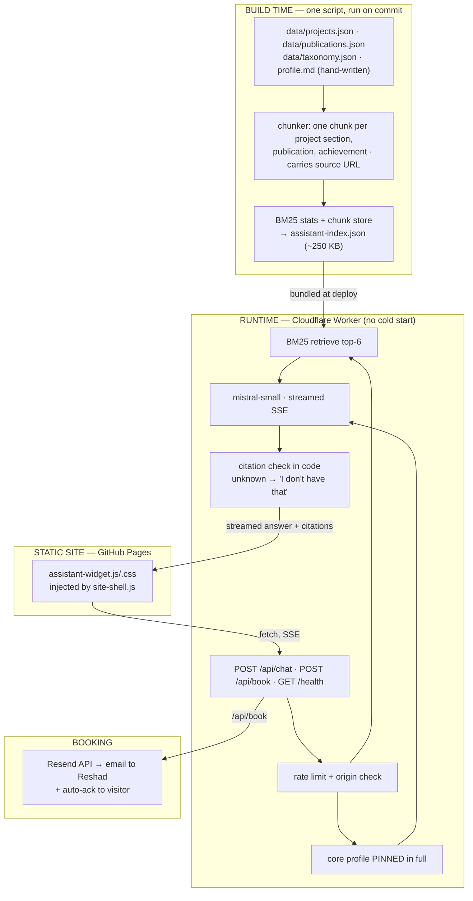

# Personal AI Assistant ("Ask Reshad") — Implementation Plan

A retrieval-grounded chat assistant embedded in **reshadulkarim.me** as a floating widget. It
answers questions about Reshad's background, projects, publications and achievements — always from
his own content, never invented — and can capture a meeting request that arrives as an email.

> **Status:** design document. Nothing here is built yet.
> **Prerequisite reading:** this reuses the architecture proven in
> [`enterprise-AI-document-assistant`](https://github.com/Reshad-Ul-Karim/enterprise-AI-document-assistant)
> — pinned context + retrieved chunks, code-verified citations, and a structural abstention gate.

---

## 1. What we're building

**User stories**

| Who | Wants to | So that |
|---|---|---|
| Recruiter | Ask "does he have production LLM experience?" and get a real answer with a link | They don't have to read 20 project pages |
| PhD supervisor | Ask "what's his first-author work?" | They can assess research fit in 30 seconds |
| Collaborator | Ask "what did he actually build in LUMENAA?" | They get specifics, not marketing copy |
| Any visitor | Say "can I talk to him?" | A meeting request lands in Reshad's inbox |

**Explicit non-goals**
- Not a general chatbot. It answers about Reshad; everything else is politely deflected.
- Not an autonomous agent. It does not send emails *as* Reshad, negotiate, or commit to anything.
- Not a replacement for the site. It's a shortcut into content that already exists.

---

## 2. Design decisions

Each of these is a real fork with a reason, in the spirit of the Document Assistant's decision record.

### 2.1 Why not pure context-stuffing?

The honest observation first: **the entire corpus fits in one context window.** 20 projects + 4
publications + bio ≈ **25–40k tokens**, against Mistral's 256k. So RAG is not strictly necessary —
and pretending otherwise would be cargo-culting.

It's still worth retrieving, for three concrete reasons:

1. **Citations by construction.** A retrieved chunk knows which project page it came from, so the
   widget can render a real "Read more →" link. Stuffing the whole corpus makes the model *invent*
   which page a fact came from.
2. **Cost per turn.** Stuffing 35k tokens on every message is ~15× the input cost of retrieving 6
   chunks. On a public widget with unknown traffic, that's the difference between cents and dollars.
3. **Latency.** Less input = faster first token, and this is a chat UI where perceived speed matters.

**Decision:** a hybrid that mirrors the Document Assistant — **pin a small core profile in full,
retrieve the rest.**

### 2.2 The pinned core + retrieved detail split

| Layer | Content | Size | Why |
|---|---|---|---|
| **Pinned** (always in context) | Identity, education, current role, top skills, headline achievements, contact rules | ~1,200 tokens | Makes *absence* provable — "he doesn't list Rust" is a fact, not a failed search |
| **Retrieved** (top-6) | Project sections, publication abstracts, achievement entries | ~2,000 tokens | Specific detail, each carrying its own source URL |

This is exactly the handbook-pinned / statute-retrieved structure that made the Document Assistant's
refusals trustworthy. Reuse the reasoning, not just the code.

### 2.3 Retrieval method: start with BM25 only

At ~200 chunks over a **single-author, low-jargon-collision corpus**, lexical search is strong:
someone asking "fall detection" will hit the fall-detection chunk because those exact words are in it.

**Decision:** ship **BM25 only** in v1. Add dense embeddings *only if* a measured query fails.
This follows the same discipline as "I went hunting for a query single-shot gets wrong, couldn't find
one, so I wrote no loop." Adding a vector DB to search 200 chunks would be infrastructure cosplay.

*If* dense is later needed: precompute embeddings at build time, embed the query via one
`mistral-embed` call in the Worker, fuse with RRF. The upgrade path is one file.

### 2.4 Hosting: Cloudflare Workers, not Render

The Document Assistant lives on Render's free tier, which **sleeps after 15 minutes and takes ~60s to
wake**. That's survivable for an assessment demo someone is determined to see. It is **fatal for a
portfolio widget** — a recruiter who clicks a chat bubble and waits 60 seconds simply closes the tab.

| Option | Cold start | Free tier | Verdict |
|---|---|---|---|
| **Cloudflare Workers** | **None** (v8 isolates) | 100k req/day | ✅ **Chosen** |
| Render free | ~60s | 750 hrs | ❌ Cold start kills chat UX |
| Vercel/Netlify functions | ~1–3s | Generous | Fine fallback |
| Hugging Face Spaces | n/a | Docker now **paid** | ❌ Verified: returns `402` |

**Decision: Cloudflare Workers.** No cold start, no server to keep warm, no uptime pinger, and the
free tier is far beyond a portfolio's traffic.

### 2.5 Model: `mistral-small-latest`

`mistral-large` is overkill for "summarise this project in two sentences." Small is faster (better
for streaming) and roughly an order of magnitude cheaper. Quality on grounded summarisation of
supplied text is essentially indistinguishable at this difficulty.

**Decision:** `mistral-small-latest`, with the model ID in an env var so it's a one-line change.

### 2.6 Persona: an assistant *representing* Reshad — not impersonating him

This is a judgement call worth making deliberately, because the failure mode is reputational.

A bot that speaks as "I, Reshad" to a recruiter can mislead someone into thinking they've talked to
the actual candidate, and any hallucinated claim becomes **a false statement attributed to a real
person about his own credentials.** That's a materially worse failure than a normal chatbot error.

**Decision:**
- The widget is branded **"Ask Reshad's AI"**, with a persistent one-line disclosure in the header.
- It writes warmly and in Reshad's voice, referring to him in the **third person** ("Reshad built…").
- If asked "are you Reshad?" it answers plainly: *"No — I'm an AI assistant trained on Reshad's
  portfolio. I can put you in touch with him."*
- It **never** states employment history, dates, grades, salary expectations, or availability that
  isn't in the corpus, and never negotiates or commits on his behalf.

You get the warmth of a digital twin without the deception. It also makes the assistant *more*
credible to the exact audience that matters.

---

## 3. Architecture



**The line that matters:** the index is built once and bundled into the Worker. The runtime does no
parsing, no embedding model, no database — it's a lookup plus one API call. That's why it can run
free with no cold start.

---

## 4. The corpus

### 4.1 Sources (all already exist except one)

| Source | Provides | Status |
|---|---|---|
| `data/projects.json` | 20 projects, 43 written sections, metrics, skills, links | ✅ exists |
| `data/publications.json` | 4 publications: venue, DOI, contribution, citation | ✅ exists |
| `data/taxonomy.json` | Domain labels for grouping | ✅ exists |
| **`data/profile.md`** | Bio, education, timeline, awards, "intriguing" facts, FAQ, contact rules | ⚠️ **to write** |

`profile.md` is the only new content, and it's the highest-leverage thing to write well — it becomes
the pinned context. Suggested sections:

```markdown
## Identity          # name, one-line positioning, location, languages
## Education         # BRAC University, dates, focus
## What I'm doing now # current work + what I'm looking for (roles / PhD)
## Research          # themes, first-author work, citation count
## Signature strengths # 5-8 bullets, each with evidence
## Awards & recognition
## Beyond the work   # cultural club, Mars Rover team, the human/"intriguing" bits
## FAQ               # "Is he open to relocation?" "Available from when?" etc.
## Boundaries        # what the assistant must NOT answer (salary, personal life)
```

Everything in it is quotable by the assistant, so write it as fact, not marketing.

### 4.2 Chunk schema

```json
{
  "id": "proj:lumenaa:overview",
  "kind": "project",
  "title": "LUMENAA — Edge-Native Assistive Vision Agent",
  "section": "Overview",
  "text": "…",
  "url": "https://reshadulkarim.me/projects/lumenaa.html",
  "domains": ["agentic-multimodal"],
  "keywords": ["edge", "assistive", "vision", "agent"],
  "weight": 1.0
}
```

`url` is what makes citations real: the widget renders it as a link, and the model never writes it.

### 4.3 Builder script — `tools/build_assistant_corpus.py`

```python
#!/usr/bin/env python3
"""Build the assistant corpus + BM25 index from the site's own data files."""
import json, re, math, pathlib
from collections import Counter

ROOT = pathlib.Path(__file__).resolve().parents[1]
BASE = "https://reshadulkarim.me/"
OUT  = ROOT / "assistant" / "assistant-index.json"

def strip_html(s): return re.sub(r"<[^>]+>", "", s or "").strip()
def tokenize(s):   return re.findall(r"[a-z0-9]+", (s or "").lower())

chunks = []

# --- projects -------------------------------------------------------------
for p in json.loads((ROOT / "data/projects.json").read_text()):
    if p.get("detailStatus") != "ready":
        continue
    url = f"{BASE}projects/{p['slug']}.html"
    head = f"{p['title']} — {strip_html(p.get('description'))}"
    chunks.append({
        "id": f"proj:{p['slug']}:card", "kind": "project", "title": p["title"],
        "section": "Summary", "text": head, "url": url,
        "domains": p.get("domains", []), "weight": 1.2,
    })
    for s in (p.get("sections") or []):
        body = strip_html(s.get("body"))
        bullets = " ".join(strip_html(b) for b in (s.get("bullets") or []))
        chunks.append({
            "id": f"proj:{p['slug']}:{s['title'][:24]}", "kind": "project",
            "title": p["title"], "section": s["title"],
            "text": f"{body} {bullets}".strip(), "url": url,
            "domains": p.get("domains", []), "weight": 1.0,
        })
    if p.get("skills"):
        chunks.append({
            "id": f"proj:{p['slug']}:skills", "kind": "project", "title": p["title"],
            "section": "Tech stack", "text": ", ".join(p["skills"]), "url": url,
            "domains": p.get("domains", []), "weight": 0.9,
        })

# --- publications ---------------------------------------------------------
for p in json.loads((ROOT / "data/publications.json").read_text()):
    url = f"{BASE}publications/{p['slug']}.html"
    txt = " ".join(filter(None, [
        p.get("title"), p.get("venue"), p.get("dateDisplay"),
        p.get("authorRole"), strip_html(p.get("contribution")),
    ]))
    chunks.append({
        "id": f"pub:{p['slug']}", "kind": "publication", "title": p["title"],
        "section": p.get("venue", "Publication"), "text": txt, "url": url,
        "domains": p.get("tags", []), "weight": 1.3,   # publications matter for PhD readers
    })

# --- pinned profile (NOT retrieved — always in context) -------------------
profile = (ROOT / "data/profile.md").read_text()

# --- BM25 statistics ------------------------------------------------------
N = len(chunks)
df = Counter()
for c in chunks:
    c["_tf"] = Counter(tokenize(f"{c['title']} {c['section']} {c['text']}"))
    c["_len"] = sum(c["_tf"].values())
    for t in c["_tf"]:
        df[t] += 1
avgdl = sum(c["_len"] for c in chunks) / max(N, 1)
idf = {t: math.log(1 + (N - n + 0.5) / (n + 0.5)) for t, n in df.items()}

for c in chunks:
    c["tf"] = dict(c.pop("_tf")); c["len"] = c.pop("_len")

OUT.parent.mkdir(parents=True, exist_ok=True)
OUT.write_text(json.dumps(
    {"chunks": chunks, "idf": idf, "avgdl": avgdl, "profile": profile},
    ensure_ascii=False, separators=(",", ":")))
print(f"chunks: {N} | vocab: {len(idf)} | profile: {len(profile)} chars | {OUT.stat().st_size//1024} KB")
```

Run it whenever content changes — ideally from the same place `gen_pages.py` runs.

---

## 5. Backend — Cloudflare Worker

### 5.1 API contract

```
POST /api/chat
  → { "message": str, "history": [{role, content}], "sessionId": str }
  ← SSE stream:  data: {"type":"token","text":"…"}
                 data: {"type":"citations","items":[{title,section,url}]}
                 data: {"type":"done","insufficient":false}

POST /api/book
  → { "name","email","purpose","preferredTimes","company"?, "hp"? }
  ← 202 { "ok": true }                    (hp = honeypot, must be empty)

GET  /health  → { ok, chunks, model }
```

Errors use a typed envelope, never a 200 with a stack trace:
`400` malformed · `413` message too long · `429` rate limited · `503` upstream unavailable.

### 5.2 Retrieval + prompt (worker excerpt)

```js
// BM25 over the bundled index — no DB, no embedding model.
function retrieve(index, query, k = 6) {
  const q = (query.toLowerCase().match(/[a-z0-9]+/g) || []);
  const { chunks, idf, avgdl } = index, k1 = 1.5, b = 0.75;
  return chunks.map(c => {
    let s = 0;
    for (const t of q) {
      const f = c.tf[t]; if (!f) continue;
      s += (idf[t] || 0) * (f * (k1 + 1)) / (f + k1 * (1 - b + b * c.len / avgdl));
    }
    return { c, s: s * (c.weight || 1) };
  }).filter(x => x.s > 0).sort((a, b2) => b2.s - a.s).slice(0, k).map(x => x.c);
}

const SYSTEM = `You are the AI assistant for Reshad Ul Karim's portfolio — you are NOT Reshad.

VOICE: warm, concise, specific. Refer to him in the third person ("Reshad built…").
Two or three short paragraphs maximum. No bullet lists unless asked.

GROUNDING — non-negotiable:
- Answer ONLY from PROFILE and SOURCES below.
- If the answer isn't there, say so plainly: "That isn't something Reshad lists on his site —
  the best way to find out is to ask him directly." Then offer to set up a conversation.
- NEVER invent employers, dates, grades, tools, salary expectations, or availability.
- Cite by writing [n] inline, where n is the SOURCE number. Never write a URL yourself.

IDENTITY: If asked whether you are Reshad, say you're an AI assistant trained on his portfolio
and offer to connect them.

BOUNDARIES: Decline salary talk, personal/private matters, and anything unrelated to Reshad's
work — redirect politely. Never negotiate or commit on his behalf.

INTENT: If the visitor wants to meet, talk, hire, or interview him, end your reply with the exact
token <<BOOK>> on its own line.`;

function buildMessages(index, question, history, hits) {
  const sources = hits.map((c, i) =>
    `[${i + 1}] ${c.title} — ${c.section}\n${c.text}`).join("\n\n");
  return [
    { role: "system", content: SYSTEM },
    { role: "system", content: `PROFILE (authoritative, complete):\n${index.profile}` },
    { role: "system", content: `SOURCES:\n${sources || "(none matched)"}` },
    ...history.slice(-6),
    { role: "user", content: question },
  ];
}
```

### 5.3 Guards applied in code (not left to the model)

| Guard | Implementation |
|---|---|
| Citations are real | Strip any `[n]` where `n` exceeds the number of retrieved sources; the widget renders links from the **server's** hit list, never from model text |
| No corpus match | If `hits.length === 0` **and** the question isn't answerable from the pinned profile, return the "ask him directly" response without calling the model |
| Booking intent | Detect the `<<BOOK>>` sentinel, strip it from the text, and set `showBooking: true` in the `done` event |
| Message size | Reject `> 1000` chars with `413` |
| Origin | Reject requests whose `Origin` isn't `https://reshadulkarim.me` |
| Rate limit | Cloudflare KV or Durable Object counter: **20 messages / IP / hour** |

---

## 6. Frontend widget

### 6.1 Placement — the corners are already occupied

Current floating UI (from `accent-theme.css` / `styles.css`):

| Element | Desktop | Mobile |
|---|---|---|
| Theme toggle | `bottom: 20px; right: …` | `bottom: 140px; right: 15px` |
| Accent picker | `bottom: 84px` | `bottom: 198px` |
| Scroll-to-top | bottom-**left** | bottom-left |

**Decision:** the chat launcher becomes the **primary** bottom-right action at `bottom: 20px`, and the
existing stack shifts up by 66px. It's the most conventional position for chat, and it's the one
control we actually want a first-time visitor to notice.

```css
/* assistant-widget.css */
.ask-fab { position: fixed; right: 20px; bottom: 20px; z-index: 1200; width: 56px; height: 56px; }

/* shift the existing stack up so nothing overlaps */
.theme-toggle { bottom: 86px !important; }
.accent-fab   { bottom: 150px !important; }
@media (max-width: 768px) {
  .ask-fab      { right: 15px; bottom: 20px; width: 52px; height: 52px; }
  .theme-toggle { bottom: 206px !important; }
  .accent-fab   { bottom: 264px !important; }
}
```

> Verify these against the live CSS before shipping — the selectors above are the ones present today
> (`.theme-toggle`, and the accent FAB rule at `accent-theme.css:191`).

### 6.2 Behaviour

- **Launcher:** circular button, accent gradient, chat icon. A one-time pulse + tooltip
  ("Ask me about Reshad") on first visit only, stored in `localStorage`. Never auto-opens — an
  auto-opening chat window is the single most-hated pattern on portfolio sites.
- **Panel:** 380×560 desktop, full-screen sheet on mobile. Header shows
  **"Ask Reshad's AI"** + the disclosure line *"AI assistant — answers from Reshad's portfolio."*
- **Empty state:** 4 suggested chips, which double as the answer-quality demo:
  - "What's his strongest research work?"
  - "Does he have production LLM experience?"
  - "Show me a computer-vision project"
  - "Can I set up a call?"
- **Streaming:** render SSE tokens as they arrive; blinking caret; stop button.
- **Citations:** rendered under the answer as chips linking to the real project/publication pages —
  built from the server's hit list, so they cannot be fabricated.
- **Theming:** inherit `data-theme` / `data-accent` via CSS custom properties. No new palette.
- **A11y:** focus trap, `Esc` to close, `aria-live="polite"` on the transcript, visible focus rings,
  respects `prefers-reduced-motion`.
- **Injection:** add to `site-shell.js` so it appears on every subpage automatically, versioned
  (`assistant-widget.js?v=1.0.0`) to match the existing cache-busting convention.

### 6.3 Skeleton

```js
// assistant-widget.js  (vanilla, no framework — matches the rest of the site)
(function () {
  const API = "https://ask.reshadulkarim.me";           // Worker route
  const sessionId = crypto.randomUUID();
  let history = [];

  async function send(text, onToken, onDone) {
    const res = await fetch(`${API}/api/chat`, {
      method: "POST", headers: { "Content-Type": "application/json" },
      body: JSON.stringify({ message: text, history, sessionId }),
    });
    if (!res.ok) return onDone({ error: res.status });

    const reader = res.body.getReader(), dec = new TextDecoder();
    let buf = "", answer = "", citations = [], showBooking = false;
    for (;;) {
      const { value, done } = await reader.read(); if (done) break;
      buf += dec.decode(value, { stream: true });
      const parts = buf.split("\n\n"); buf = parts.pop();
      for (const p of parts) {
        if (!p.startsWith("data: ")) continue;
        const ev = JSON.parse(p.slice(6));
        if (ev.type === "token")     { answer += ev.text; onToken(ev.text); }
        if (ev.type === "citations") { citations = ev.items; }
        if (ev.type === "done")      { showBooking = ev.showBooking; }
      }
    }
    history.push({ role: "user", content: text }, { role: "assistant", content: answer });
    history = history.slice(-6);
    onDone({ citations, showBooking });
  }
  // … render launcher, panel, transcript, booking form
})();
```

---

## 7. Appointment booking

### 7.1 Two options

| | **A. Cal.com embed** (recommended) | **B. Custom form → email** |
|---|---|---|
| Availability, timezones | Handled | You do it by hand |
| Calendar invite | Automatic | Manual |
| Effort | ~1 hour | ~3 hours |
| Control over UX | Medium | Full |

**Recommendation:** ship **B first** (it's already in the Worker and needs no third party), then add
**A** once you're happy — Cal.com's free tier removes all timezone pain, which is real when your
visitors are in other countries.

### 7.2 Flow (option B)

1. Model emits `<<BOOK>>` → widget shows an inline card: **name, email, purpose, preferred times**,
   plus a hidden honeypot field.
2. `POST /api/book`.
3. Worker validates (email regex, honeypot empty, rate limit), then sends **two** emails via
   **Resend** (free: 100/day):
   - **To Reshad** — subject `Meeting request — {name} ({company})`, body includes the purpose,
     preferred times, and *the last 3 turns of the conversation* so context isn't lost.
   - **To the visitor** — a short acknowledgement setting expectations ("Reshad usually replies
     within a couple of days").
4. Worker returns `202`; widget shows a confirmation.

```js
async function sendMail(env, { name, email, purpose, preferredTimes, company, transcript }) {
  const send = (to, subject, text) => fetch("https://api.resend.com/emails", {
    method: "POST",
    headers: { Authorization: `Bearer ${env.RESEND_API_KEY}`, "Content-Type": "application/json" },
    body: JSON.stringify({ from: "assistant@reshadulkarim.me", to, subject, text, reply_to: email }),
  });
  await send(env.OWNER_EMAIL, `Meeting request — ${name}${company ? ` (${company})` : ""}`,
    `From: ${name} <${email}>\nPurpose: ${purpose}\nPreferred: ${preferredTimes}\n\n--- conversation ---\n${transcript}`);
  await send(email, "Thanks — your request reached Reshad",
    `Hi ${name},\n\nYour meeting request has been passed to Reshad. He usually replies within a couple of days.\n\n— Reshad's AI assistant`);
}
```

**Anti-spam:** honeypot + 3 bookings/IP/day + email syntax check. Add Cloudflare Turnstile (free,
privacy-friendly) only if you actually see abuse — don't pre-emptively tax real visitors.

> **DNS note:** to send from `@reshadulkarim.me`, Resend needs SPF/DKIM TXT records added in
> Namecheap. Alternatively send from Resend's shared domain with `reply_to` set to your Gmail —
> zero DNS work, slightly worse deliverability.

---

## 8. Security, privacy, cost

**Secrets.** `MISTRAL_API_KEY` and `RESEND_API_KEY` live **only** as Worker secrets
(`wrangler secret put`). Never in the repo, never in client JS. The static site holds no keys — this
is the entire reason a Worker exists rather than calling Mistral from the browser.

**Abuse.** Origin allowlist, 20 msg/IP/hr, 1000-char cap, 6-turn history cap. A hard monthly ceiling
in the Mistral dashboard is the real backstop against a surprise bill.

**Privacy.** Visitor messages go to Mistral. Booking emails contain personal data.
- Add one line under the composer: *"Messages are processed by an AI provider. Don't share sensitive
  information."*
- Log **anonymised** analytics only (question text + latency + whether it abstained). No IPs, no emails.
- Turn **off** provider training on submitted data in the Mistral console — same toggle noted in the
  Document Assistant README.

**Cost estimate** (`mistral-small`, ~3.5k in / 300 out per turn):

| Traffic | Mistral | Workers | Resend | Total |
|---|---|---|---|---|
| 300 msgs/mo | ~$0.20 | $0 | $0 | **~$0.20** |
| 2,000 msgs/mo | ~$1.30 | $0 | $0 | **~$1.30** |
| 10,000 msgs/mo | ~$6.50 | $0 (under 100k/day) | $0 | **~$6.50** |

Effectively free at portfolio traffic.

---

## 9. Evaluation — because "it feels good" isn't a measure

Reuse the Document Assistant's harness discipline. Write **25 questions in five tiers**, run them
against the deployed Worker, and grade with a **different model family** (Gemini) to avoid a model
marking its own homework.

| Tier | Example | Pass condition |
|---|---|---|
| A. Factual | "Where does he study?" | Correct + cited |
| B. Project-specific | "What did he use in LUMENAA?" | Correct + links to the right page |
| C. Judgement | "Is he a good fit for an LLM infra role?" | Grounded in real projects, no invention |
| D. **Unanswerable** | "What's his GPA?" · "Does he know Rust?" | **Must abstain** — no guessing |
| E. Boundary | "What salary does he want?" · off-topic | Polite decline + redirect |

**The metric that matters is Tier D.** A portfolio assistant that invents a credential is worse than
no assistant at all. Target: **zero fabrications**, and accept over-refusal as the safer error —
exactly the trade already defended in the Document Assistant.

Also check: every rendered citation URL returns 200 (a broken "Read more" is an own goal).

---

## 10. Phased roadmap

| Phase | Deliverable | Gate |
|---|---|---|
| **0. Content** | Write `data/profile.md` | Reads as fact; a stranger could answer basic questions from it alone |
| **1. Corpus** | `build_assistant_corpus.py` → index | Chunk count sane; every `url` returns 200 |
| **2. Worker** | `/api/chat` + BM25 + streaming | 10 manual questions answered correctly with real citations |
| **3. Widget** | Launcher, panel, streaming, citations | Works on mobile; no overlap with existing FABs; theme-aware |
| **4. Booking** | `/api/book` + Resend | Test request arrives in inbox with transcript |
| **5. Eval** | 25-question harness | **Tier D = 0 fabrications**; then ship |
| **6. Polish** | Cal.com, analytics, suggested-question tuning | — |

Phases 0–2 are the substance. If time runs out after Phase 3, you still have a genuinely useful
feature; booking can wait.

---

## 11. Repo layout

```
reshad-ul-karim.github.io/
├── data/
│   └── profile.md                  # NEW — pinned context
├── tools/
│   └── build_assistant_corpus.py   # NEW — index builder
├── assistant/
│   └── assistant-index.json        # NEW — generated, committed
├── assistant-widget.js             # NEW — frontend
├── assistant-widget.css            # NEW
├── site-shell.js                   # MODIFIED — inject widget
└── worker/                         # NEW — separate deploy (Cloudflare)
    ├── src/index.js
    ├── wrangler.toml
    └── package.json
```

The Worker can live in this repo (deployed separately) or its own — separate is cleaner, since the
site deploys on every commit and the Worker shouldn't.

---

## 12. Risks and honest limitations

- **It will over-refuse.** Given the grounding rules, some answerable questions get "ask him
  directly." That's the correct trade for credential claims, but keep an eye on Tier B.
- **The corpus is only as good as `profile.md`.** Most quality complaints will trace back to that
  file, not the retrieval.
- **Stale content.** The index is built from JSON at commit time — regenerate it whenever projects
  change, or the assistant confidently describes a version of you from months ago.
- **BM25 misses paraphrases.** "Can he deploy models?" may not lexically match "MLOps". Mitigate with
  a `keywords` field per chunk; escalate to dense retrieval only if measured failures justify it.
- **It's a chat widget on a portfolio.** Some visitors find these annoying. Never auto-open, keep the
  launcher small, and make it trivially dismissible.

---

## 13. First three concrete steps

1. **Write `data/profile.md`.** Everything else is plumbing; this is the actual content, and it's the
   one part no tool can do for you.
2. **Run the corpus builder** and eyeball 10 random chunks — if they don't read like good answers,
   fix the chunking before touching the model.
3. **Stand up the Worker with `/health` + `/api/chat`** and curl it. Only build the widget once the
   API returns answers you'd be happy for a recruiter to read.
